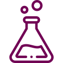
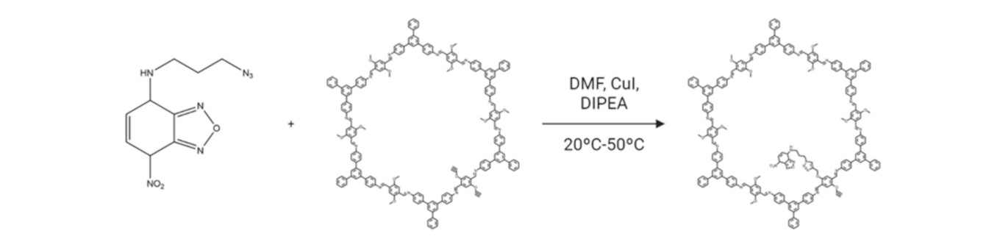

# Gabriel López Vinielles
##  Data |  Environment |  Chemistry

I'm a **Psychologist**, **Environmental Scientist** and **Data Scientist** with a strong drive towards data manipulation, analisation and presentation. I'm passionate about discovering new tools, features, languages and frameworks and using them to unlock and shed light on the endless secrets hidden in data.
## Languages, frameworks and packages
### Extraction

- BeautifulSoup
- Pandas
- NumPy
- PowerQuery
### Tranformation
- Pandas
- Scikit-learn
- DAX
### Reporting
- Matplotlib
- Seaborn
- Plotly
- Dash
- Streamlit
- Quarto
- Jupyter
- Power BI
- Web apps (DRM - React/Vanilla Javascript)

<a href="https://www.flaticon.com/authors/the-chohans-brand" title="The Chohans Brand"> Database icon created by the Chohans Brand - Flaticon</a>

<a href="https://www.flaticon.com/free-icons/joshua-tree" title="joshua tree icons">Joshua tree icon created by Freepik - Flaticon</a>

<a href="https://www.freepik.com" title="Freepik"> Flask icon created by Freepik - Flaticon</a>
